# RecruitFlow

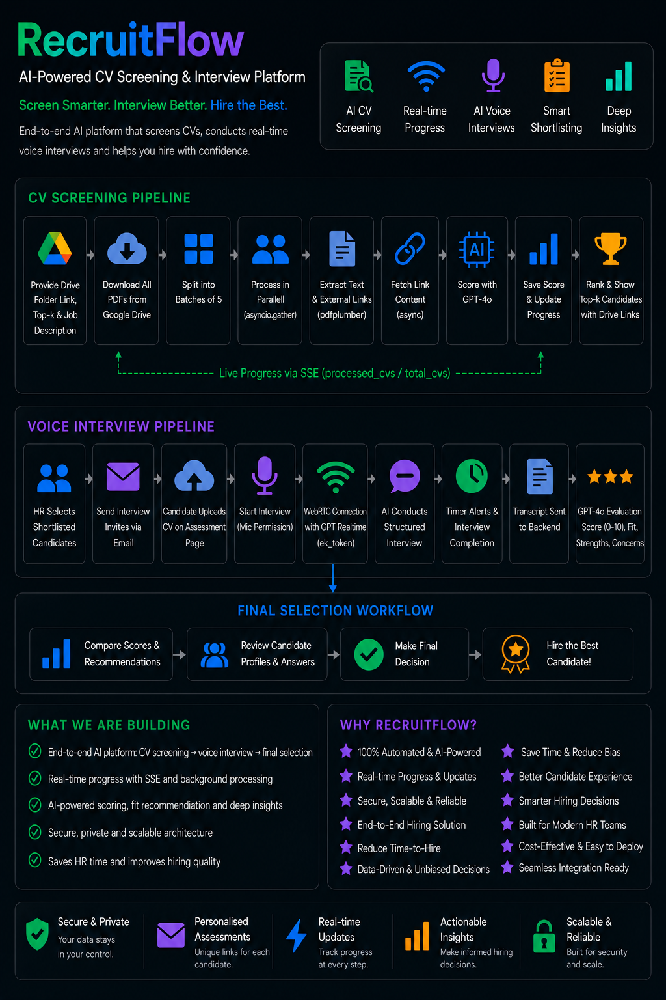


RecruitFlow is an AI-powered hiring automation platform designed to simplify and speed up the recruitment process. Instead of manually reviewing hundreds of resumes, HR teams can simply paste a Google Drive folder containing candidate CVs, enter the job description, and choose how many top candidates they want to shortlist.

The platform automatically downloads and processes every resume, extracts text and relevant external links, and uses GPT-4o to intelligently evaluate candidates based on skills, experience, and job relevance. The entire screening pipeline runs asynchronously for faster processing, while live progress updates are streamed directly to the browser in real time. Once completed, RecruitFlow presents a ranked list of the best candidates along with direct Drive preview links for quick review.

After shortlisting, HR can instantly send personalised assessment invitations to candidates via email. Each candidate receives a unique secure link where they can upload their CV and participate in a live AI-powered voice interview.

Using OpenAI Realtime AI with WebRTC, RecruitFlow conducts structured, context-aware interviews based on both the candidate’s resume and the job description. The interview is fully interactive, time-constrained, and designed to simulate a real screening round. After completion, GPT-4o automatically analyzes the interview transcript and generates detailed evaluation reports including candidate score, fit recommendation, strengths, and concerns.

RecruitFlow transforms traditional hiring into a faster, smarter, and more scalable AI-driven recruitment experience.


---

## Problem Statement
Build an AI-powered recruitment assistant that automates CV screening, ranks candidates against a job description, and conducts timed AI assessments to reduce manual HR effort and improve hiring speed/quality.

## Demo Video
- [RecruitFlow-How to use](https://drive.google.com/file/d/1bHjALqD6gJzcHbBCa2-0py6kWJSyF6xl/view?usp=sharing)
- [RecruitFlow-Explanation](https://drive.google.com/file/d/1C5PsgChLSkwswBjq6V3BYzNntNw-Q94Y/view?usp=sharing)

## Features & Functionalities
- HR login/register with JWT auth
- Create screening jobs from public Google Drive CV folders
- Async CV parsing + link enrichment + LLM-based scoring
- Live progress updates via SSE during screening
- Top-k ranking, score insights, and job history
- Shortlist email sending with personalized assessment links
- Candidate assessment portal with CV upload + voice interview
- Automated post-interview summary with score and fit recommendation

## Backend Architecture / System Design
- See [System Flow](#system-flow), [Voice Assessment Flow](#voice-assessment-flow), and [Worker Internals — Single CV](#worker-internals--single-cv)
- Backend is built as modular FastAPI services (auth, jobs, results, assessment, worker) over PostgreSQL with Alembic migrations

## Implementation Approach & Workflow
- See [How It Works](#how-it-works) for end-to-end screening and assessment workflow
- Uses async batch processing (`asyncio.gather`) for throughput and SSE for real-time UX

## APIs / Models / Tools Used
- See [Tech Stack](#tech-stack) and [API Endpoints](#api-endpoints)
- Core AI models: `gpt-4o` (CV scoring + summarization), `gpt-realtime-1.5` (live voice interview)

## How It Works

### CV Screening

1. HR logs in and fills the screening form — Drive folder link, top-k count, job description
2. Backend creates a screening job record and immediately starts a background pipeline
3. All CVs are downloaded from the public Google Drive folder
4. CVs are split into batches of 2 by default (configurable via `WORKER_BATCH_SIZE`); all batches run **in parallel** via `asyncio.gather`
5. Each CV is processed: text extracted → links found → link content fetched asynchronously → GPT-4o scores the candidate
6. Progress streams to the browser in real time via SSE (Server-Sent Events)
7. When complete, the top-k candidates are displayed ranked by score with Drive preview links

### Voice Assessment

1. HR selects shortlisted candidates, sets assessment name + duration, clicks Send Assessment
2. Backend creates an `assessment` record per candidate with a unique UUID link
3. Each candidate receives a personalised email with their private assessment URL
4. Candidate opens link, uploads their CV PDF (text extracted by pdfplumber)
5. Candidate clicks Start — browser requests mic permission, backend calls OpenAI `POST /v1/realtime/client_secrets` to get an ephemeral WebRTC token
6. Frontend POSTs an SDP offer to `POST https://api.openai.com/v1/realtime/calls` with the ephemeral token — OpenAI responds with an SDP answer
7. WebRTC peer connection established — GPT Realtime AI greets the candidate by name and conducts a structured interview based on JD + CV
8. Timer counts down; AI receives system messages at 2 min and 30 sec remaining, wraps up gracefully at 0
9. On completion the full transcript is POSTed to the backend
10. GPT-4o summarizer runs as a background task — produces score (0–10), fit recommendation, strengths, concerns

---

## System Flow

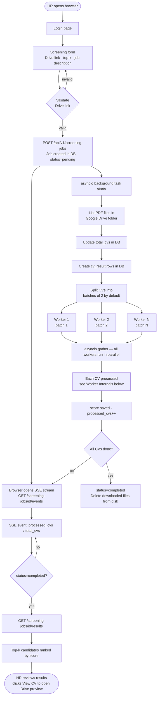

---

## Voice Assessment Flow

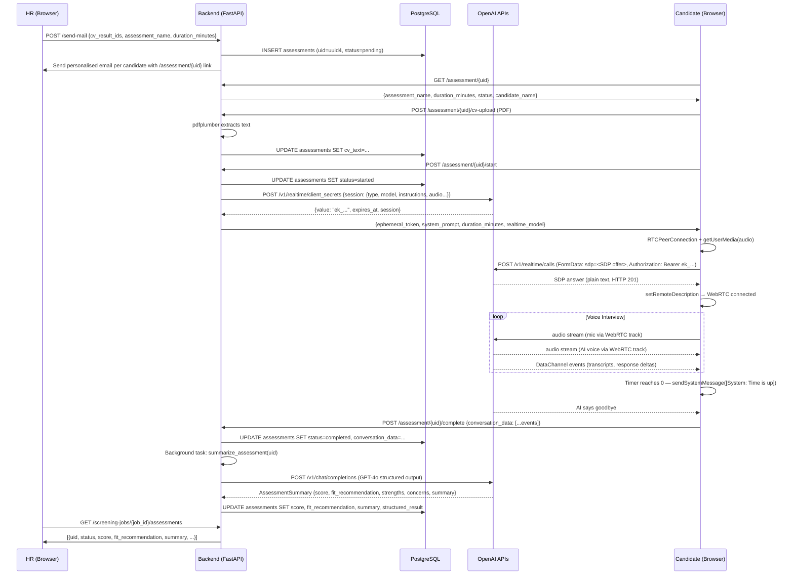

---

## Worker Internals — Single CV

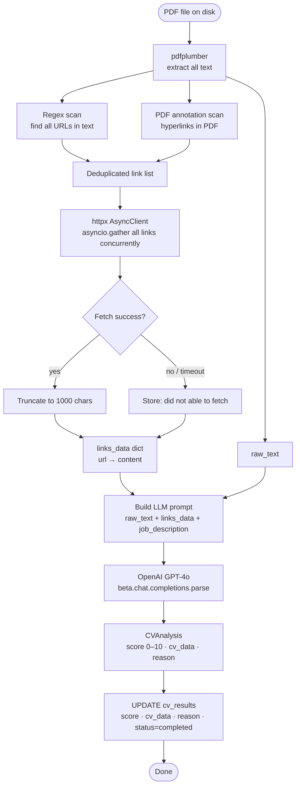

---

## Tech Stack

| Layer | Technology |
|---|---|
| API | FastAPI + Uvicorn |
| Database | PostgreSQL (Docker) / Supabase (prod) |
| ORM + Migrations | SQLAlchemy 2.x + Alembic |
| Auth | JWT via python-jose + Argon2 password hash |
| CV Scoring AI | OpenAI GPT-4o — structured output via `beta.chat.completions.parse` |
| Voice Interview AI | OpenAI GPT Realtime (`gpt-realtime-1.5`) via WebRTC |
| Ephemeral Auth | OpenAI `POST /v1/realtime/client_secrets` → short-lived `ek_...` token |
| WebRTC Signalling | `POST /v1/realtime/calls` with FormData SDP offer → SDP answer |
| Assessment Summary | GPT-4o structured output → score, fit, strengths, concerns |
| PDF extraction | pdfplumber |
| Async HTTP | httpx AsyncClient |
| Drive download | gdown + direct Drive export URLs |
| Progress push | Server-Sent Events (SSE) |
| Email | Gmail SMTP via app-specific password |
| Config | pydantic-settings — all env vars, no hardcoding |
| Logging | stdlib logging — JSON (prod) / pretty (dev) + correlation IDs |
| UI | Plain HTML + Tailwind CDN + vanilla JS |
| Container | Docker + Docker Compose |

---

## Project Structure

```
recruitflow/
├── .env                        ← your secrets (copy from .env.example)
├── .env.example                ← template
├── docker-compose.yml          ← postgres + recruitflow-api in one file
└── backend/
    ├── main.py                 ← app wiring, middleware, exception handlers
    ├── requirements.txt
    ├── Dockerfile
    ├── alembic.ini
    ├── alembic/
    │   ├── env.py              ← imports all ORM models for autogenerate
    │   └── versions/           ← migration files
    ├── config/
    │   └── settings.py         ← pydantic-settings, reads .env from root or backend/
    ├── common/
    │   ├── logger.py           ← JSON/pretty formatter, correlation ID middleware
    │   ├── errors.py           ← AppError hierarchy + FastAPI exception handlers
    │   ├── db_errors.py        ← SQLAlchemy → AppError translator + @handle_db_errors
    │   └── data_model.py       ← Pydantic BaseModel base
    ├── database/
    │   └── manager.py          ← DatabaseServiceManager, session context manager
    ├── auth/
    │   ├── manager.py          ← JWT create/verify, OAuth2 dependency
    │   └── controller.py       ← POST /auth/login
    ├── user/
    │   ├── db_models.py        ← User ORM + UserModelService
    │   ├── manager.py          ← register, authenticate
    │   ├── controller.py       ← POST /api/v1/users
    │   └── models/             ← interface, request, response
    ├── screening_job/
    │   ├── db_models.py        ← ScreeningJob ORM + ModelService
    │   ├── manager.py          ← create, get, update_status, increment_processed
    │   ├── controller.py       ← POST job, GET status, GET /events (SSE)
    │   └── models/             ← interface, request (Drive link validator), response
    ├── cv_result/
    │   ├── db_models.py        ← CvResult ORM + ModelService
    │   ├── manager.py          ← bulk_create, update_processing_result, top-k query, send_mail
    │   ├── controller.py       ← GET results, POST send-mail
    │   └── models/             ← interface, request, response
    ├── assessment/             ← voice assessment module (new)
    │   ├── db_models.py        ← Assessment ORM + AssessmentModelService
    │   ├── manager.py          ← create, get_by_uid, mark_started, save_cv_text,
    │   │                          complete, save_summary, get_realtime_session
    │   ├── controller.py       ← GET meta, POST cv-upload, POST start, POST complete,
    │   │                          GET /screening-jobs/{id}/assessments
    │   └── models/             ← interface, request, response
    ├── worker/
    │   ├── drive_client.py     ← list Drive folder files, download per-file
    │   ├── cv_processor.py     ← pdfplumber text + regex links + async httpx fetch
    │   ├── llm_client.py       ← GPT-4o structured output → CVAnalysis
    │   ├── orchestrator.py     ← batch split, asyncio.gather workers, disk cleanup
    │   ├── assessment_summarizer.py ← GPT-4o structured output → AssessmentSummary
    │   └── email_sender.py     ← Gmail SMTP send
    └── static/
        ├── index.html          ← login → form → SSE progress → ranked results → send assessment
        └── assessment.html     ← candidate page: CV upload → voice interview → completion
```

---

## Setup & Run

## Installation Steps
1. Clone the repository
2. Move to project root (`recruitflow/`)
3. Copy env template and add required secrets
4. Start services and apply migrations
5. Open app at `http://localhost:8000`

### Prerequisites

- Docker + Docker Compose
- OpenAI API key (`gpt-4o` access)
- Google Drive folder shared as **"Anyone with the link can view"**

### 1. Configure environment

```bash
cd recruitflow
cp .env.example .env
```

Edit `.env` and fill in:

```env
OPENAI_API_KEY=sk-...
JWT_SECRET_KEY=<any-long-random-string>
POSTGRES_PASSWORD=<choose-a-password>
```

For full env details, see [Environment Variables](#environment-variables) and [`.env.example`](./.env.example).

---

### 2. Run using `run.sh` (recommended)

All Docker operations are wrapped in `run.sh`. Always run from the `recruitflow/` root.

#### First time setup

```bash
# build images, start all services, apply pending migrations
bash run.sh --build
```

This single command:
1. Builds the Docker image
2. Starts PostgreSQL + API containers
3. Waits for services to be healthy
4. Runs `alembic upgrade head` to apply all pending migrations

Open `http://localhost:8000` — app is ready.

#### Generate a new migration (after changing ORM models)

```bash
# auto-generates migration, copies file to host, applies it
bash run.sh --migrate "add_column_xyz"

# or with auto timestamp name
bash run.sh --migrate
```

What it does internally:
1. `alembic revision --autogenerate` inside the container (needs live DB)
2. `docker cp` copies the generated `.py` file out to `backend/alembic/versions/` on your host
3. `alembic upgrade head` applies it

> The copied migration file should be **committed to git** so it's included in future image builds.

#### View logs

```bash
bash run.sh --api       # recruitflow-api logs, live (last 100 lines)
bash run.sh --logs      # all services logs, live
```

#### Other commands

```bash
bash run.sh --restart   # restart recruitflow-api only (no rebuild)
bash run.sh --shell     # open bash inside recruitflow-api container
bash run.sh --down      # stop containers, keep DB data
bash run.sh --reset     # stop containers + wipe DB volumes (asks confirmation)
```

#### Full command reference

| Command | Description |
|---|---|
| `bash run.sh --build` | Build images + start + apply migrations |
| `bash run.sh --migrate [msg]` | Generate migration + copy to host + apply |
| `bash run.sh --api` | Follow recruitflow-api logs |
| `bash run.sh --logs` | Follow all service logs |
| `bash run.sh --restart` | Restart recruitflow-api container only |
| `bash run.sh --shell` | Bash shell inside recruitflow-api |
| `bash run.sh --down` | Stop containers, keep volumes |
| `bash run.sh --reset` | Stop containers + wipe DB |

---

### Local Dev (without Docker)

```bash
cd recruitflow

# create venv and install deps
python3 -m venv .venv
.venv/bin/pip install -r backend/requirements.txt

# apply migrations (postgres must be running separately)
cd backend && ../.venv/bin/alembic upgrade head && cd ..

# start api
cd backend && ../.venv/bin/uvicorn main:app --reload
```

Open `http://localhost:8000`

---

## API Endpoints

### Screening

| Method | Path | Auth | Description |
|---|---|---|---|
| POST | `/auth/login` | — | Returns JWT token |
| POST | `/api/v1/users` | — | Register HR user |
| POST | `/api/v1/screening-jobs` | JWT | Submit job, returns job_id |
| GET | `/api/v1/screening-jobs` | JWT | List all jobs for current user (history) |
| GET | `/api/v1/screening-jobs/{id}/status` | JWT | Current counts + status |
| GET | `/api/v1/screening-jobs/{id}/events` | JWT (query `?token=`) | SSE progress stream |
| POST | `/api/v1/screening-jobs/{id}/cancel` | JWT | Cancel an in-progress job |
| GET | `/api/v1/screening-jobs/{id}/results` | JWT | Top-k ranked results |
| GET | `/api/v1/screening-jobs/{id}/stats` | JWT | Score distribution, avg, pass rate |
| POST | `/api/v1/screening-jobs/{id}/send-mail` | JWT | Create assessments + send personalised emails |
| GET | `/docs` | — | Swagger UI |

### Voice Assessment (public — no JWT, auth via UUID in URL)

| Method | Path | Auth | Description |
|---|---|---|---|
| GET | `/assessment/{uid}` | — | Serve `assessment.html` to candidate |
| GET | `/api/v1/assessment/{uid}` | — | Assessment metadata (name, status, duration, candidate) |
| POST | `/api/v1/assessment/{uid}/cv-upload` | — | Upload PDF; pdfplumber extracts text and stores it |
| POST | `/api/v1/assessment/{uid}/start` | — | Mark started; call OpenAI `client_secrets`; return ephemeral token + system prompt |
| POST | `/api/v1/assessment/{uid}/complete` | — | Save full transcript; trigger GPT-4o summarizer background task |
| GET | `/api/v1/screening-jobs/{job_id}/assessments` | JWT | List all assessment results for a job (for HR results page) |

---

## Environment Variables

| Variable | Default | Description |
|---|---|---|
| `POSTGRES_HOST` | `localhost` | DB host (`postgres` inside Docker) |
| `POSTGRES_PORT` | `5432` | DB port |
| `POSTGRES_USERNAME` | `hr_user` | DB user |
| `POSTGRES_PASSWORD` | — | DB password |
| `POSTGRES_DATABASE` | `recruitflow` | DB name |
| `OPENAI_API_KEY` | — | OpenAI secret key (used for CV scoring, summarizer, and Realtime token) |
| `OPENAI_MODEL` | `gpt-4o` | Model for CV scoring and assessment summarization |
| `OPENAI_REALTIME_MODEL` | `gpt-realtime-1.5` | Model for live voice interviews |
| `WORKER_BATCH_SIZE` | `2` | CVs per worker batch |
| `LINK_FETCH_MAX_CHARS` | `1000` | Max chars extracted per link |
| `LINK_FETCH_TIMEOUT_SECS` | `10` | HTTP timeout for link fetching |
| `JWT_SECRET_KEY` | — | Secret for signing JWT tokens |
| `JWT_ALGORITHM` | `HS256` | JWT signing algorithm |
| `JWT_EXPIRE_MINUTES` | `1440` | Token lifetime (24 h) |
| `GMAIL_ADDRESS` | — | Gmail sender address (required for assessment emails) |
| `GMAIL_APP_PASSWORD` | — | Gmail app-specific password (not your regular password) |
| `ENV` | `dev` | `dev` = pretty logs · `prod` = JSON logs |
| `LOG_LEVEL` | `INFO` | Root log level |

---

## Screenshots
1. `Step 01 - Auth Register`
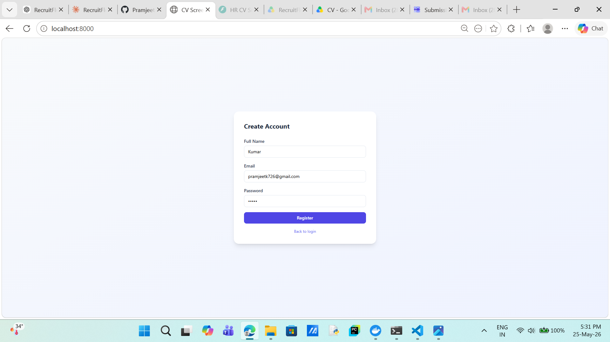

2. `Step 02 - New Screening Job Form`
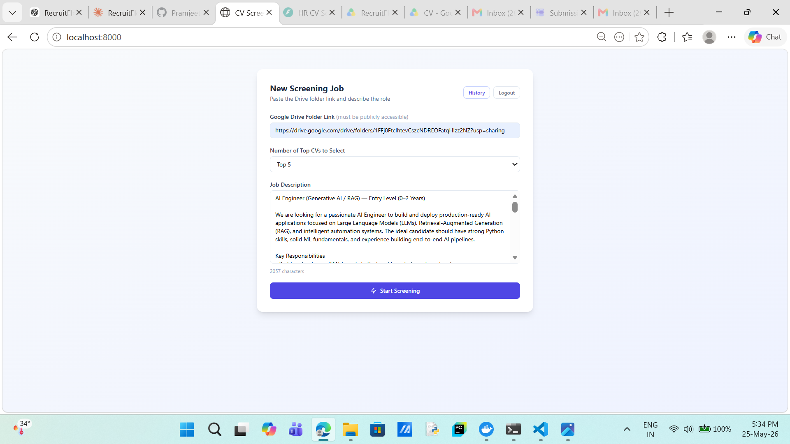

3. `Step 03 - Drive Scan In Progress`
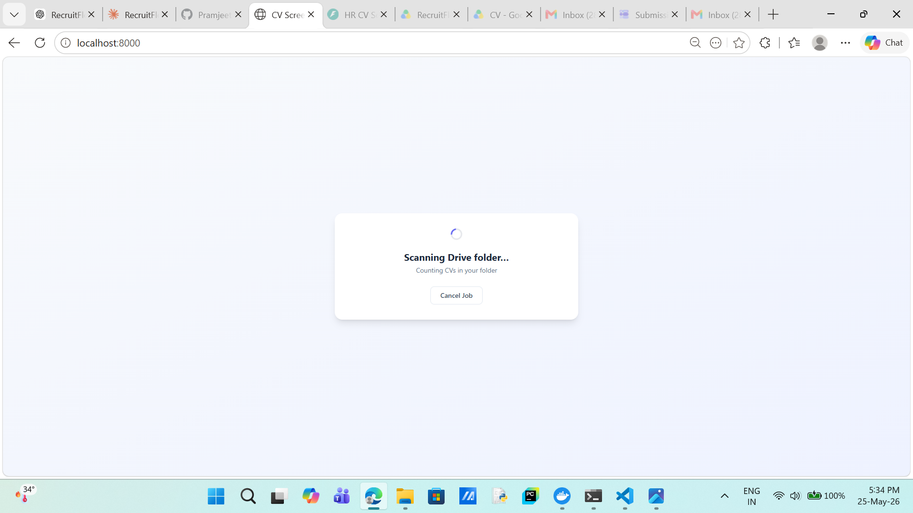

4. `Step 04 - Top Candidates Dashboard`
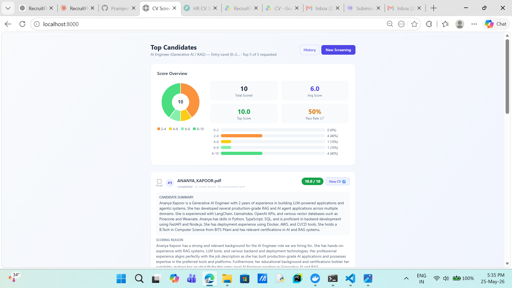

5. `Step 05 - Send Shortlist Email Modal`
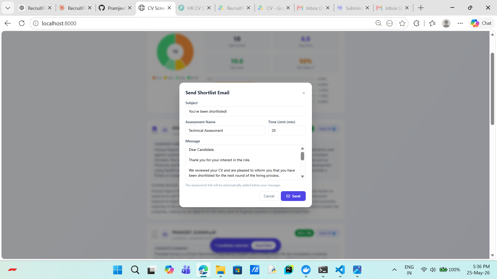

6. `Step 06 - Shortlist Email Inbox`
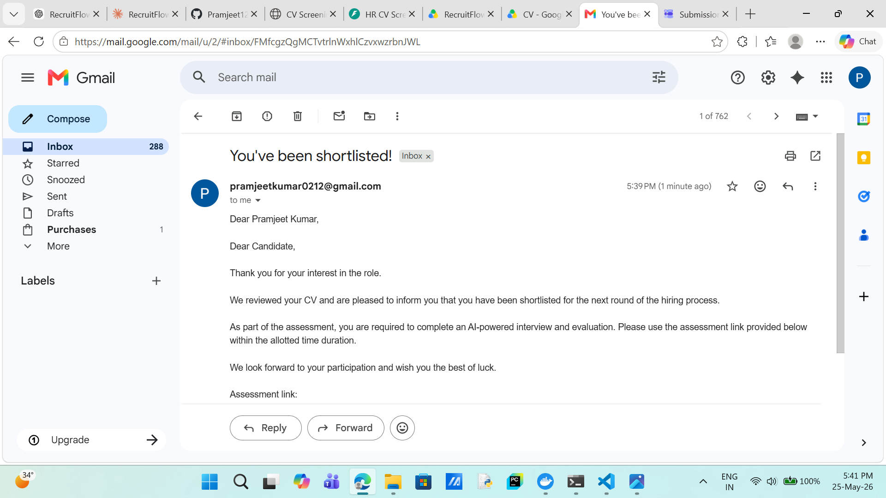

7. `Step 07 - Shortlist Email Link Preview`
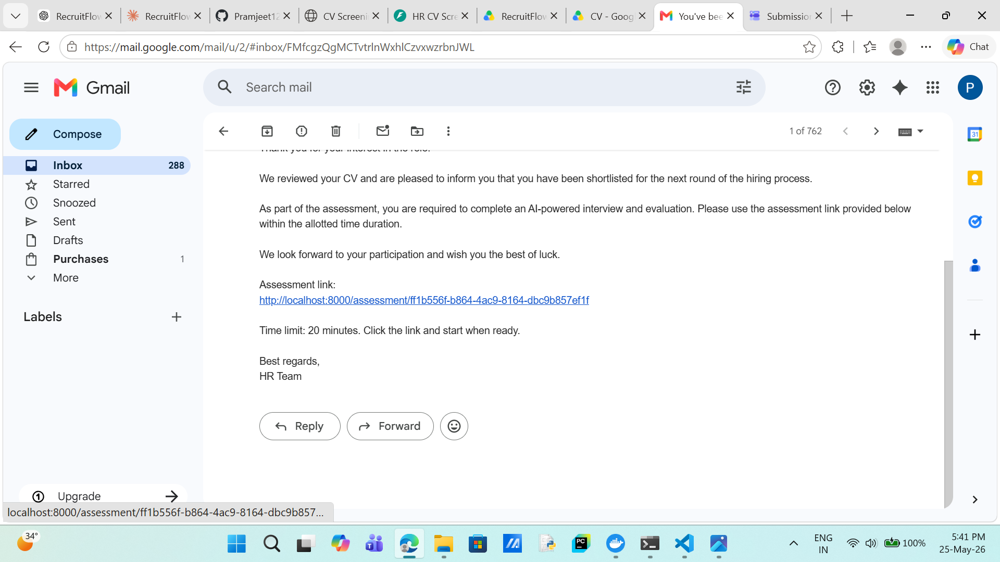

8. `Step 08 - Assessment CV Upload`
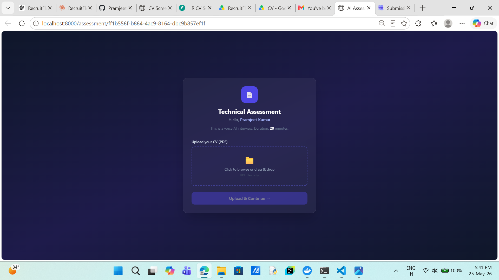

9. `Step 09 - Assessment Ready Screen`
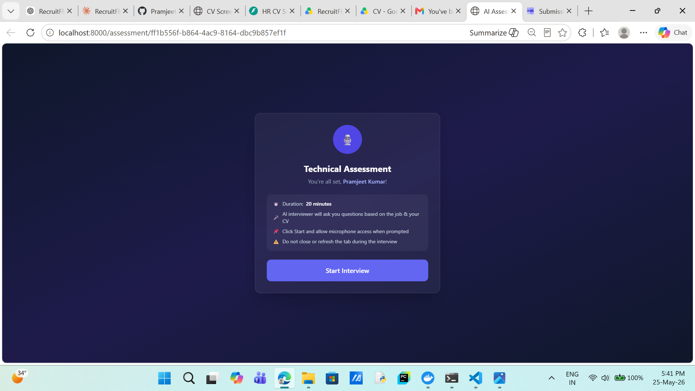

10. `Step 10 - Live AI Interview`
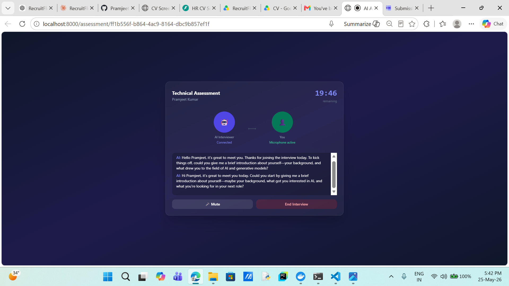

11. `Step 11 - Interview Complete Screen`
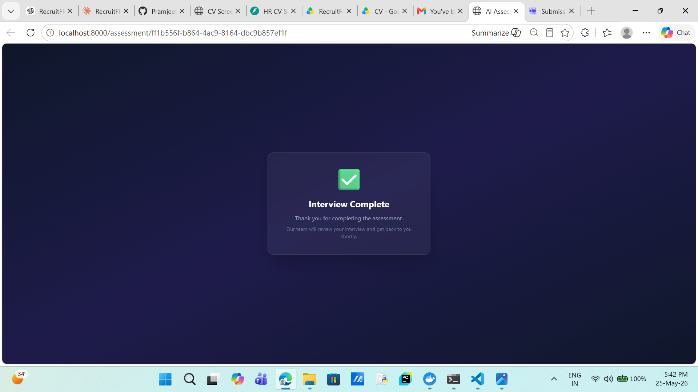

12. `Step 12 - Assessment Summary Modal`
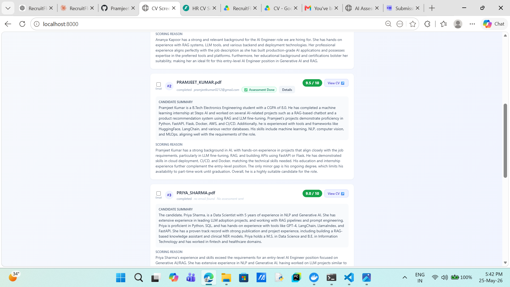

13. `Step 13 - Assessment Tag on Results`
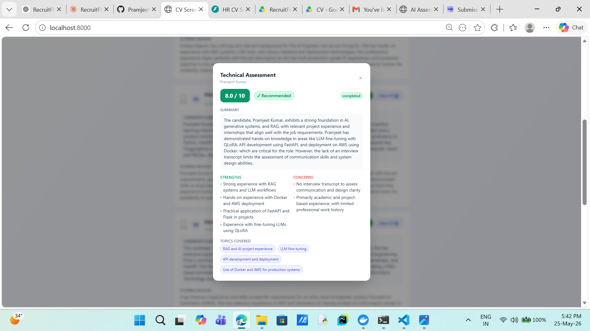
